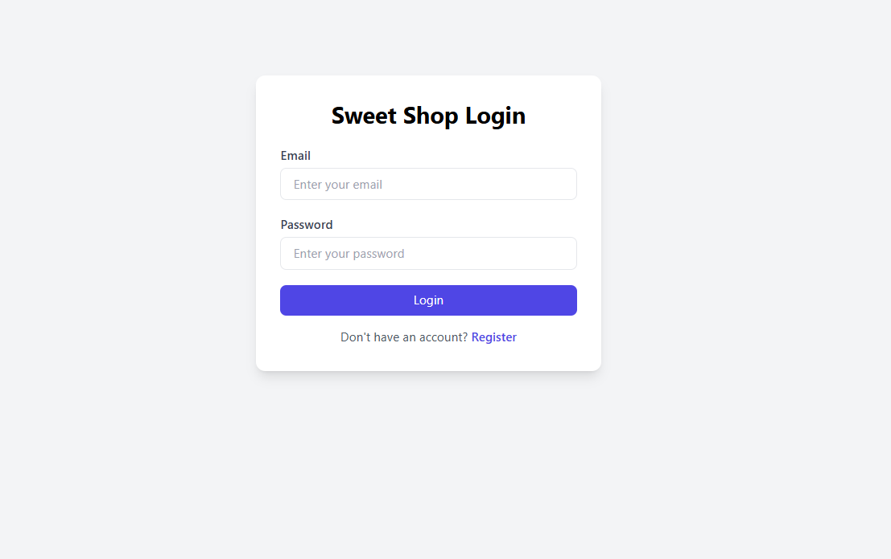
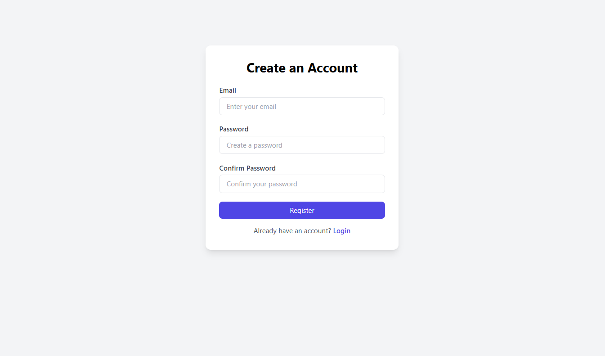
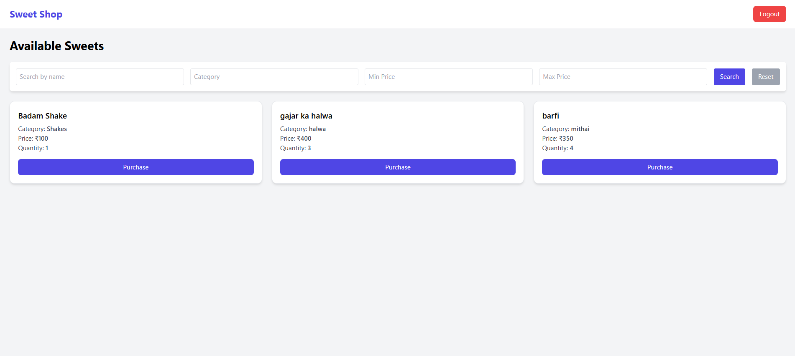
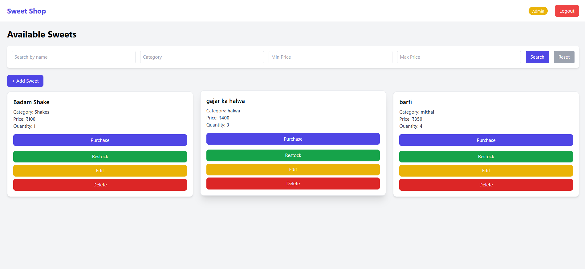
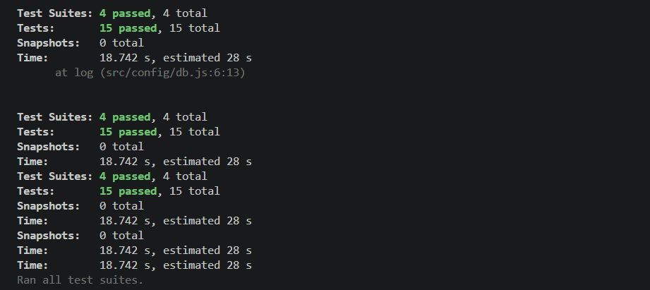

# 🍬 Sweet Shop Management System

A full-stack application built using **Node.js (Express)**, **MongoDB**,
and **React (Vite)**, following **Test-Driven Development (TDD)**
principles.

This system allows users to browse and purchase sweets, while admin
users can manage inventory by adding, updating, deleting, and restocking
sweets.

------------------------------------------------------------------------

# 🚀 Features

## 👤 Authentication

-   User registration
-   User login
-   JWT-based authentication
-   Admin vs User role-based access
-   Protected routes on both frontend and backend

## 🍭 Sweet Management

### For all authenticated users:

-   View all sweets
-   Search by name
-   Filter by category
-   Filter by price range
-   Purchase sweets (quantity decreases)

### Admin-only:

-   Add new sweets
-   Edit sweet details
-   Delete sweets
-   Restock sweets
-   Admin panel visibility is fully restricted

## 🧪 Test-Driven Development (TDD)

The backend uses: - **Jest** - **Supertest**

Red → Green → Refactor pattern followed in commit history.

------------------------------------------------------------------------

# 🗂️ Project Structure

        sweet-shop-system/
        │
        ├── backend/
        │   ├── src/
        │   │   ├── config/            # Database connection, env setup
        │   │   ├── controllers/       # Auth & Sweets controllers
        │   │   ├── middleware/        # Auth middleware, admin check
        │   │   ├── models/            # Mongoose models (User, Sweet)
        │   │   ├── routes/            # API routes
        │   │   ├── tests/             # Jest + Supertest TDD tests
        │   │   ├── validators/        # Request validation (optional)
        │   │   ├── app.js             # Express app configuration
        │   │   └── server.js          # Server entry point
        │   ├── .env                   # Backend environment variables
        │   ├── jest.config.cjs        # Jest config
        │   ├── package.json
        │   └── package-lock.json
        │
        └── frontend/
            ├── public/                # Static assets served by Vite
            ├── src/
            │   ├── api/               # Axios instance & API helper files
            │   ├── components/        # Navbar, Loader, ProtectedRoute, etc.
            │   ├── context/           # AuthContext for JWT state
            │   ├── pages/             # Login, Register, Dashboard
            │   ├── App.jsx            # Main React component
            │   ├── index.css          # Global styles
            │   └── main.jsx           # React entry point
            ├── .gitignore
            ├── eslint.config.js
            ├── index.html
            ├── package.json
            ├── package-lock.json
            └── vite.config.js

------------------------------------------------------------------------

# ⚙️ Backend Setup

## 1. Navigate to backend folder

``` bash
cd backend
```

## 2. Install dependencies

``` bash
npm install
```

## 3. Create `.env` file

    MONGO_URI=your_mongodb_uri
    JWT_SECRET=your_secret_key

## 4. Run backend

``` bash
npm run dev
```

------------------------------------------------------------------------

# 🎨 Frontend Setup

## 1. Navigate to frontend folder

``` bash
cd frontend
```

## 2. Install dependencies

``` bash
npm install
```


## 3. Run frontend

``` bash
npm run dev
```

------------------------------------------------------------------------

# 🧪 Running Tests (Backend)

``` bash
npm test
```
------------------------------------------------------------------------

# 🛡️ Creating an Admin User (Required for Admin Panel)

By default, all registered users are created with the role: "user"

To access the admin features (Add, Edit, Delete, Restock sweets), you must convert at least one user into an **admin**.

### 🔥 Recommended Approach (Simple & Quick)

Use **MongoDB Compass** or **MongoDB Atlas** to manually edit the user document.

### Steps:

1. Open your MongoDB database in Compass/Atlas  
2. Go to the **users** collection  
3. Find the user you want to make admin  
4. Click **Edit**  
5. Change the field:
    role: "user"
    to:  "admin"

6. Save the document  

🎉 Your user is now an **admin**.  
The next time you log in, the frontend will show the full **Admin Panel** (Add, Edit, Delete, Restock).

---

### Why Manual Editing?

Because this project is a **kata assignment**, not a production system, manually updating the role is:

- Quick  
- Safe  
- Meets project requirements  
- Avoids adding unnecessary admin-creation routes  


------------------------------------------------------------------------

# 📸 Screenshots

Below are screenshots of the Sweet Shop Management System.  


## 🔐 Login Page



## 📝 Register Page



## 🏠 User Dashboard
Shows available sweets, purchase button, filters, etc.




## 🎛️ Admin Dashboard
Shows admin controls like add, edit, delete, restock sweet.




------------------------------------------------------------------------
# 🧪 Test Report

The backend test suite was executed using **Jest + Supertest**.

You can view the full detailed report here:

👉 [`reports/test-results.json`](backend/reports/test-results.json)

This file contains:
- Test execution results
- Number of passed/failed tests
- Execution time
- Test suite structure

A screenshot of the test output is also included below:



------------------------------------------------------------------------
# 📝 My AI Usage

I actively used AI tools (ChatGPT) during the development of this
project.

### What AI tools I used

-   ChatGPT

### How I used AI

-   API structural brainstorming
-   Help writing Jest tests
-   UI layout suggestions
-   Debugging errors
-   Writing README.md

### Reflection

AI accelerated development while I ensured full understanding and manual
refinement.

------------------------------------------------------------------------

# 🙌 Credits

Developed by **Harshvardhan Sharma**
